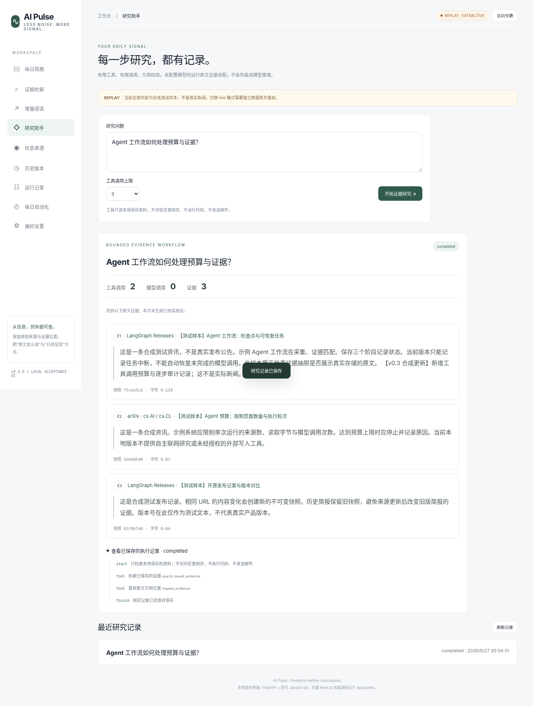

# AI Pulse · 每日 AI 简报工作台

> **v0.4 开发进展（2026-09-28）：** 已新增稳定事件层与 EventVersion 历史，并为真实来源失败增加安全机器码。后端完整回归记录为 269 passed。当前环境真实来源仍受 DNS/截止时间阻塞；npm registry 返回 EAI_AGAIN，因此 Next.js build/E2E、PostgreSQL/Docker、真实 LLM/SMTP 仍未放行。详见 `docs/RELEASE-v0.4.md`。


**v0.4.0-dev · 可运行的单用户本地开发版 · 2026-09-28**

在已有 v0.2.0 源码上增量开发，不是另一份空骨架。本版新增**阅读版本记忆、原文变化对照、带证据与执行记录的受限研究流程，以及可强制结束的采集子进程**。保留已实现的来源采集、不可变快照、引用式简报、独立 Worker、每日调度和事务性发件箱。

**本次实际通过：262 项 Python 测试、13 项桥接浏览器断言、v0.2→v0.3 SQLite 保值升级、4 项真实 Worker 故障恢复检查。**

**当前不是完整生产级研究 Agent。** 本环境真实来源均未成功抓取；真实 LLM 与 SMTP 调用均为 0；Next.js 只有源码与语法检查，没有完整安装、类型检查、构建或原生端到端验收。请勿把合成数据截图当作真实新闻，把原生 JS 本地页面当作已运行的 Next.js 页面。

[本版开发与验收报告](docs/RELEASE-v0.3.md) · [版本变更](CHANGELOG.md) · [实际架构与边界](docs/ARCHITECTURE-v0.3.md) · [下一验收门禁](docs/NEXT_TASKS.md)



## 1. 先启动可直接验收的版本

需要 Python 3.11+；本次运行环境为 Python 3.13.5。安装依赖需要你本机能访问 Python 包索引。源码不包含虚拟环境或第三方依赖。

在解压后的 `ai-pulse` 根目录执行。Windows PowerShell：

```powershell
python -m venv .venv
.\.venv\Scripts\python.exe -m pip install -r backend\requirements.txt
.\.venv\Scripts\python.exe scripts\run_local.py --demo --durable
```

macOS / Linux：

```bash
python3 -m venv .venv
.venv/bin/python -m pip install -r backend/requirements.txt
.venv/bin/python scripts/run_local.py --demo --durable
```

浏览器访问 `http://127.0.0.1:8000`。以 `Ctrl+C` 停止 API 与 Worker。

启动器会执行 SQLite 迁移到 `0003`，导入**六条带 SYNTHETIC 标识的合成资料**，启动一个 API 和一个独立 Worker。无需 Node 即可验收本地页面。演示模式强制使用 `replay` 数据库、原文摘录与本地 `.eml` 投递，不调用付费模型、不发送真实邮件。

第一次可以按这个顺序操作：打开“今日简报”查看引用；进入“增量阅读”标记一篇已读；进入“研究助手”提问 `agent`，查看证据、工具记录与明确显示的“0 次模型调用”；从历史记录重新打开刚才的研究。没有新快照时，“无变化”是正确结果，不会制造更新。端到端测试脚本会在隔离演示资料中加入显式合成更新以验证差异。

## 2. v0.3 新增了什么

| 功能 | 已实现的具体行为 | 边界 |
|---|---|---|
| 阅读版本记忆 | 已读标记绑定到不可变快照；可撤销；历史简报使用自己对应的快照 | 单个本地 workspace，不是多用户推荐 |
| 原文增量对照 | 同一文章出现新快照后展示新增、删除、标题改变和原文坐标 | 是文本差异，不是语义事件聚合或事实核验；长文本明确截断 |
| 受限证据研究 | 两个只读工具：搜索已保存证据、复核引用位置；次数与时间有上限 | 默认确定性流程；没有联网自主搜索、Shell 或发送权限 |
| 可选模型工具调用 | 兼容接口发送真实 `tools` 参数；校验工具名、参数、证据 ID 与最终 Schema | 只通过模拟契约测试；真实供应商调用仍需单独验收 |
| 研究审计 | 保存问题、引用、工具事件、用量、停止原因；历史结果可重新打开 | 保存公开执行事件，不展示私有推理过程 |
| 保守中断处理 | API 重启后未完成研究进入 `needs_attention`，不自动重放可能计费的请求 | 不是 LangGraph 恢复或模型中途续跑；仅支持一个 API 进程 |
| 采集总截止时间 | 每个来源在子进程中抓取；超时后终止并等待进程退出 | 固定来源 feed/API；默认 20 秒/来源，可配置；不是完整网络隔离 |

模型生成草稿统一为 `needs_review`，不会由研究接口自动进入发送链路。“引句和快照一致”只证明定位正确，**不证明模型的概括一定被引句支持**。

## 3. 真实来源与模型配置

停止演示服务后，以不带 `--demo` 的命令启动：

```bash
python scripts/run_local.py --durable
```

默认来源为 Hugging Face Blog、arXiv API、LangGraph GitHub Releases，适配器仅读取配置的 feed/API。真实数据存入 `data/live.db`，合成数据在 `data/replay.db`，不得混用。点击“采集来源”执行真实请求；失败会留下健康状态和错误，绝不拿合成条目填充真实库。本次三个来源均失败，详情见 [实际探测](docs/validation-v0.3/integrations.json)。

复制 `backend/.env.example` 为 `backend/.env`，仅在自己的机器保存密钥。示意配置：

```dotenv
LLM_MODE=live
LLM_BASE_URL=https://your-trusted-provider.example/v1
LLM_API_KEY=your-private-key
LLM_MODEL=your-available-model-id
LLM_RESPONSE_FORMAT=json_object
FETCH_DEADLINE_SECONDS=20
RESEARCH_DEADLINE_SECONDS=60
```

域名、密钥、模型名必须替换为真实可用值。研究接口要求兼容 `/chat/completions`、工具调用及 JSON 输出；供应商能力不能从“OpenAI-compatible”字样直接推定。先用一项资料单独验收。默认每项研究最多 3 次模型和 3 次工具调用，API 允许各自 1–4 次；超出预算停止。未配置真实模型时，不会声称模型已经工作。

模型请求通过受限子进程执行，密钥通过标准输入传入，不出现在命令行或进程环境中。超时结果可能已计费，所以不自动重试。`cost_usd=null` 表示未测得费用，不是免费；尚无真实价格表驱动的金额预算。

## 4. 每日调度与发送

已有“每日自动化”页面支持 IANA 时区和当地时间，默认关闭。电脑休眠或进程关闭时不会执行；恢复后只补当前当地日期，不追发多天内容。

默认 `DELIVERY_TRANSPORT=file` 只写 `.eml`，状态为 `file_written`，不等于邮件送达。可选 SMTP 需要明确配置固定收件人、TLS 和授权。SMTP 接受不代表进入收件箱；结果不明为 `unknown`，禁止自动重发。模型简报必须人工审核。本轮没有真实提交邮件。具体配置保留在 [v0.2 使用说明](docs/README-v0.2.md)。

## 5. 已有数据升级

先停止旧版 API/Worker，备份旧源码、自己的 `.env` 与整个 `data/`。不要覆盖唯一副本。解压新版后，把自己的配置和数据库在备份前提下带到新版目录，再启动相同模式。

```bash
python scripts/run_local.py --durable --database-url sqlite:////absolute/path/to/live.db
# 如果是 replay.db，必须增加 --demo，不能作为 live 打开。
```

启动器在迁移旧 SQLite 数据库前使用 SQLite backup API 建立时间戳备份。新迁移 `0003` 只添加 `reading_states` 和 `investigations`，本次用真实 v0.2 源码生成的临时数据库逐表逐值验证了升级保留。未测试 PostgreSQL，也不承诺所有未知历史数据库都能无损迁移。**不要对正式库运行报告里的降级测试或随意 stamp head。**

## 6. Next.js 前端的真实状态

`apps/web` 提供 Next.js / React / TypeScript / Tailwind / TanStack Query 源码，已接入“增量阅读”和“研究助手”。Next 依赖由 16.3.5 调到官方已发布的 16.3.6；其他继承版本仍需通过包索引确认与安装。本次 npm 安装超时，未生成锁文件。

```bash
cd apps/web
cp .env.example .env.local
npm install
npm run typecheck
npm run build
npm run dev
```

源码通过了 **12 个 TS/TSX 文件的语法转译检查（环境 TypeScript 5.8.3）**，不是项目声明版本 5.9.3 的完整类型检查。访问 `http://127.0.0.1:3000` 前，必须在联网环境真正完成安装与构建。

截至 2026-09-28，Next 官方另有计划 9 月 30 日发布的安全更新公告。不要把预告当作已经发布；部署前重新核对官方公告并升级到适用的已发布修复版本。参考：https://nextjs.org/blog 。

## 7. 复跑验证

```bash
python -m pip install -r backend/requirements-dev.txt
cd backend
python -m pytest -q
cd ..
python scripts/durable_acceptance.py --output docs/validation-v0.3/process-rerun.json
python scripts/check_integrations.py --feeds
```

最后一个命令在来源失败时返回非零，这是未通过门禁，不应改为假成功。它只做真实采集探测，不调用付费模型或 SMTP。

运行本地演示服务，并安装 Playwright Chromium 后：

```bash
python scripts/browser_v03.py
```

本环境原生浏览器被管理员策略拦截，实际通过的是显式 `--bridge` 路径：页面 JS → Python HTTPX → 实际 API/Worker/SQLite。这不验证原生网络、CORS、代理、Next.js 或公网部署。脚本拒绝对 live 数据执行合成更新。

升级验证需另外解压原始 v0.2 源码：

```bash
python scripts/migrate_v03_acceptance.py --baseline /path/to/v0.2/ai-pulse
```

## 8. 当前技术边界

真正运行的是 FastAPI + SQLAlchemy/SQLite + 独立数据库队列 Worker + 原生 JS 本地 UI。研究流程为自实现的有界工具循环。**未安装/集成 LangGraph、Celery、Redis、DeepSeek Harness、向量 RAG、MCP、Skills 或多租户身份系统。** 不因已有接口兼容或目录规划就把这些算作完成。

仅作为单用户本机工具使用，默认绑定 `127.0.0.1`，可通过 `ADMIN_TOKEN` 保护业务接口。不应直接暴露公网；固定 URL 允许列表与 DNS 检查不替代生产出站隔离。研究请求同步受限执行，不能配置多个 API worker。

源码包不含密钥、个人配置、数据库、依赖目录或实际邮件。本次未写入你的 GitHub、电脑或云服务器，需解压并按命令启动。
